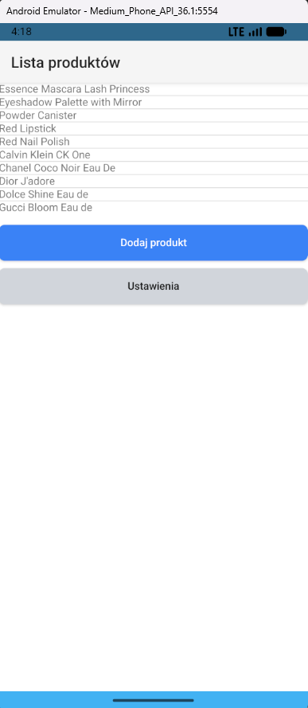
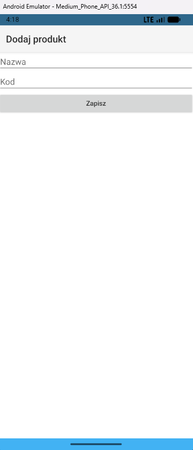
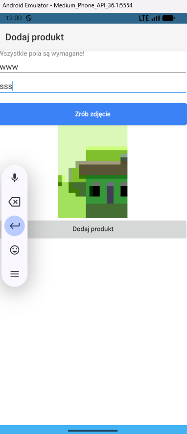
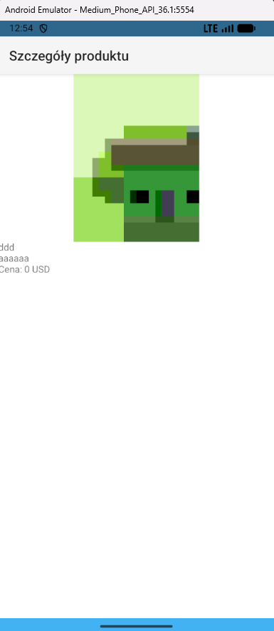
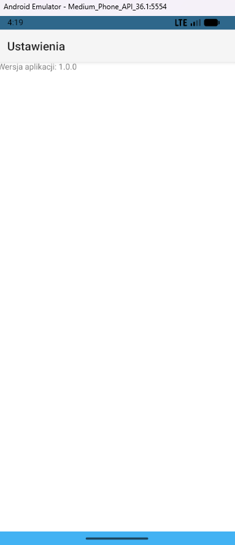

# NativeScript Products App

## Funkcjonalności

### 1. Lista produktów
- Wyświetla listę produktów pobranych z API: https://dummyjson.com/products  
- Pobierane jest 10 pierwszych produktów.
- Produkty dodane lokalnie wyświetlane są na samej górze listy.

### 2. Szczegóły produktu
- Pokazuje tytuł, opis i zdjęcie (jeśli produkt został dodany lokalnie).
- Dla produktów z API szczegóły są pobierane dynamicznie po ID.
- Dla lokalnych produktów dane pochodzą z pamięci.

### 3. Dodaj produkt
- Formularz z polami: tytuł i opis.
- Możliwość wykonania zdjęcia przez kamerę.

## Natywne funkcje

Aplikacja wykorzystuje jedną natywną funkcję urządzenia:

### Aparat (kamera)
- Obsługa poprzez `@nativescript/camera`.
- Użytkownik może wykonać zdjęcie z poziomu formularza.
- Na emulatorze Androida kamera może być symulowana.

## Komunikacja z API

### Pobieranie listy produktów

GET https://dummyjson.com/products?limit=10

### Zapis produktu
Wymaganie POST nie jest konieczne — dodawane produkty są przechowywane lokalnie w `ProductService` i łączone z listą produktów z API.

W przypadku braków pokazywany jest komunikat błędu.

## Widoki w aplikacji

- `/` — Lista produktów  
- `/details/:id` — Szczegóły produktu  
- `/add` — Dodaj produkt  
- `/settings` — Ustawienia  

## Wykorzystane technologie

- NativeScript 9  
- Angular (standalone components)  
- TailwindCSS  
- NativeScript Camera  
- Emulator Android (Pixel 6, API 36)

## Jak uruchomić projekt

### 1. Instalacja zależności

npm install

### 2. Uruchomienie na emulatorze Android

ns run android

### 3. Alternatywnie — uruchomienie w trybie Preview

ns preview

## Zrzuty ekranu

### Lista produktów

### Dodawanie produktu

### Szczegóły produktu

### Ustawienia

